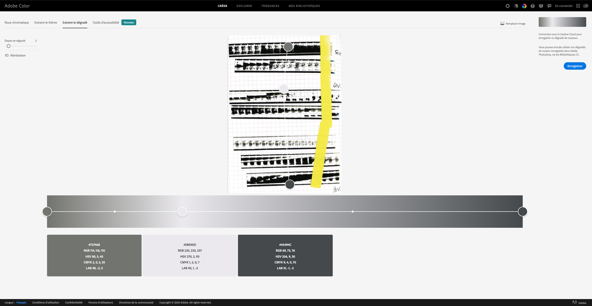
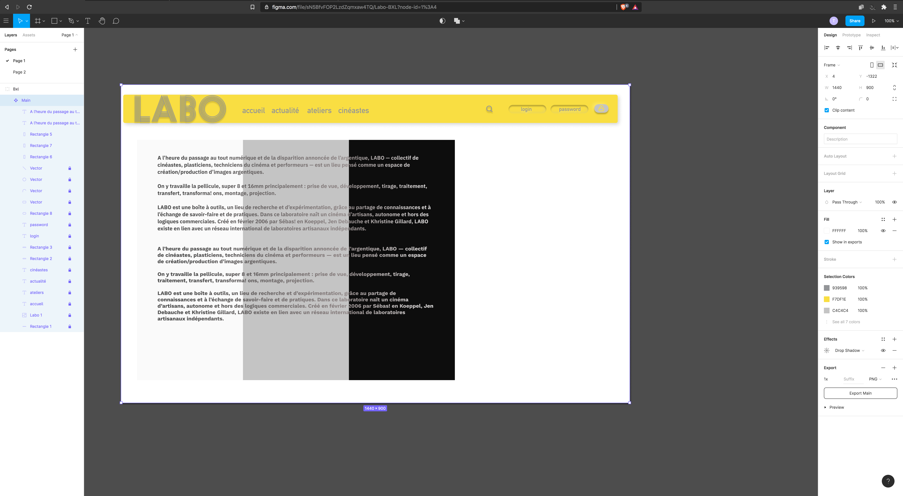

# npProject

- Repository: `OOP`
- Type de challenge:  `Consolidation`
- Durée: `4 semaines`
- Deadline: `16/11/20 9 A.M.`
- Déploiement :
- Github page
- Heroku
- Heroku + remote DBA
- self-hosting
- Team challenge :  `solo`

## The Mission

### Full Stack Challenge

Labo BXL

Laboratory for processing and research around film.

Created in February 2006, LABO is a place thought as a space for image creation/production. We work there on film - mainly super 8 and 16mm. Shooting, development, processing, transfer, transformations, tests.

LABO is a toolbox, a place for research and experimentation, thanks to the sharing of knowledge and the exchange of know-how and practices.

In this laboratory is born a cinema of craftsmen, autonomous and out of the commercial logics.

  

### ui/ux prototyping
 
- Figma
- Adobe Color 
- Font Forge 

  

  

  

 
### Frontend 

- Htm5
- Css
- Javascript
- Chart.js
- EJS

### Backend 

- Node.js 
- MongoDB
- Redis
- Express 
- Joi

### Api

- Next Cloud 

### Versioning

- Git 

### Credits 

- Done by [Thomas Depas](https://github.com/Thdepas) October 2020 - BeCode Web Developer training
